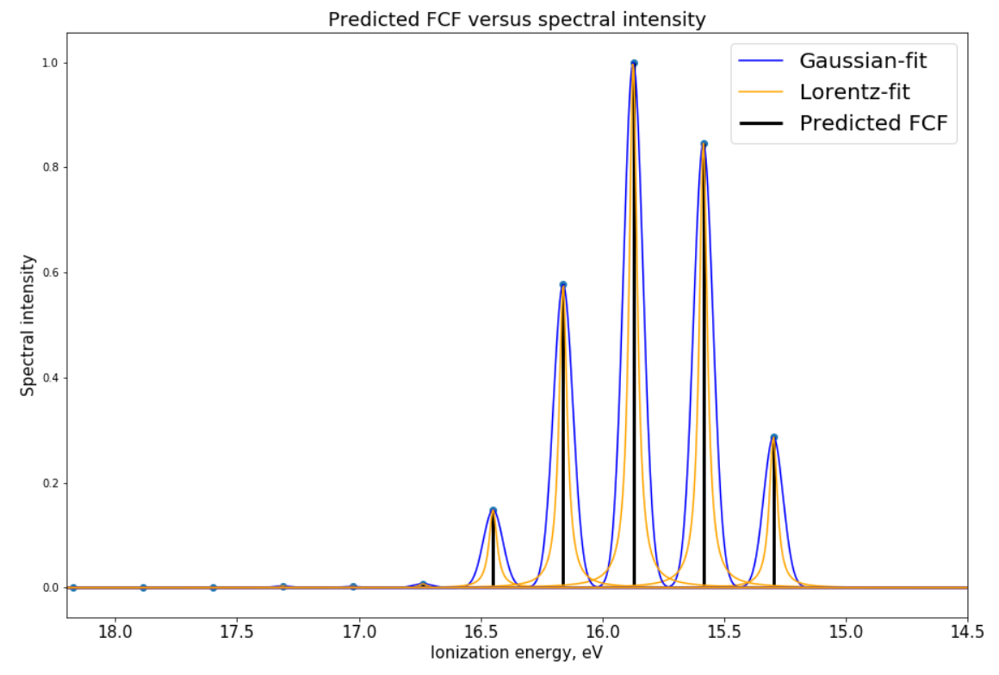
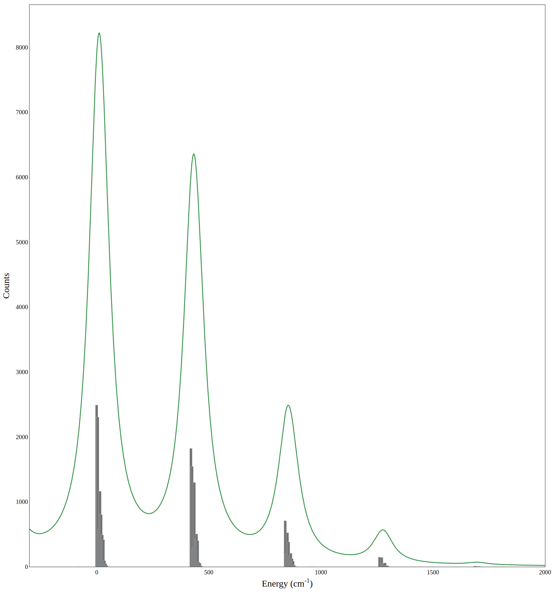

## Project 3: Franck-Condon Factors

This project will guide you through calculating Franck-Condon Factors, which is related to the intensities in spectra of vibrational transitions across electronic surfaces. Spectra can be measured through experiments, but having accurate theoretical calculations of these Franck-Condon Factors allow scientists to instead predict these experimental results. This is especially useful if the chemical species is expensive, difficult to acquire or difficult to study or if the experiment itself is expensive or difficult.

A very brief introduction to the main ideas behind the project are
[here.](https://github.com/CDL-Quantum/CohortProject_2020/blob/master/CDL_2020_docs.pdf)

In our [Project3_LandingPage.pdf](https://github.com/CDL-Quantum/CohortProject_2020/blob/master/Project_3_Franck_Condon_Factors/Project3_LandingPage.pdf), we provide more technical information about the chemistry and physics behind these Franck-Condon Factors and we encourage you to explore more literature if interested.  Click on this link to begin learning about your tasks for this week!

## Tasks include:
* Calculate the Franck-Condon Factors (and spectra) of molecular Hydrogen using a simple model
* Calculate the Franck-Condon Factors (and spectra) of a more complex molecule (V3) using matrix elements
* Calculate the Franck-Condon Factors (and spectra) of that molecule using vibronic sampling. This calculation involves Gaussian Boson Sampling (GBS), which would allow these factors to be calculated using a quantum circuit.

#### Task 1: Solution 
In this task, we calculated the Frank-Condon factors for H2-H2+ molecules using the harmonic oscillator approximation. The jupyter notebook with solutions is here: [Task1.ipynb](Task1.ipynb)

#### Task2: Solution
In task two, we compiled the FC.cxx code. The program was able to generate the Frank-Codon factors for the H2-H2+ molecule. The figure of the spectra is below

#### Task3: Solution
In task three, we simulated Gaussian Boson sampling to compute the Frank-Codon factors. This required us to modify the code from task 2 to generate the required input file. After
we had the correct input file our code was able to generate a spectra which matched what was generated for task 2.

The modifified task2 code is here: [modified task2 code](Task2Code/FCC.cxx)

The jupyter notebook for our solution is here: [jupyter notebook for task3](Task3.ipynb)

The ouput of our jupyter notebook is below.

## Further Challenges:
* An alternative and analogous method to calculating these Franck-Condon Factors using matrix elements is to use a loop hafnian approach. This loop hafnian approach uses GBS which would allow these factors to be calculated using a quantum circuit. Use the result of Task 3 to provide data to a skeleton code provided that uses loop hafnians to calculate the Franck-Condon Factors.
* Explain briefly the similarities and differences between these three methods.
* What are advantages and disadvantages of codes licensed for the public domain and those that are licensed for private use

## Business Application
One again, your team is asked to complete a Business Application. Questions you will be asked are:

* Explain to a layperson the technical problem you solved in this exercise.
* Explain or provide examples of the types of real-world problems this solution can solve.
* Identify at least one potential customer for this solution - ie: a business who has this problem and would consider paying to have this problem solved.
* Prepare a 90 second video explaining the value proposition of your innovation to this potential customer in non-technical language.

For more details refer to the [Business Application found here](./Business_Application.md)

## Presenting your results in your pull request
For your pull request, consider the following for the presentation of your final results:
- Work entirely in the directory for Project 3.
- Edit this README.md file with a highlight of your main technical results.  Provide links to any other files with your detailed results, e.g. Jupyter notebooks.
- For your Business Application, feel free to provide your answers directly in the 
[Business_Application.md](./Business_Application.md) file.
- Do not directly upload your video file (or any other large files) to the repository.  Instead, provide a link e.g. to a YouTube video, or a Google Drive file.
- Include a file contributions.md that lists the contributions of each group member.
